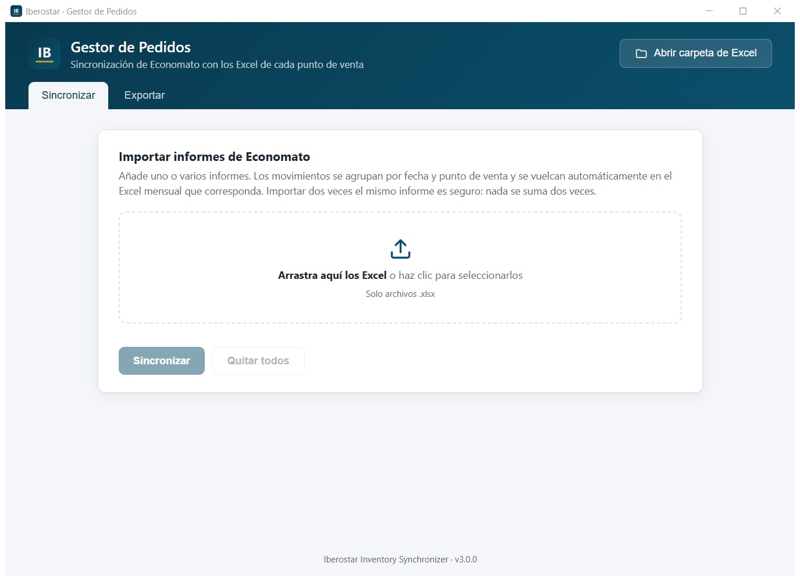

<div align="center">


# Iberostar · Gestor de Pedidos

### Del informe del almacén al Excel de cada bar, en segundos y sin copiar nada a mano.

Aplicación de escritorio para Windows que lee los informes del **Economato** (el almacén central
del hotel) y vuelca automáticamente cada entrega en el **Excel de control de stock** del punto de
venta que la recibió: día, producto y cantidad en su sitio, sin errores y sin duplicados.

[](https://github.com/walteralee/iberostar-inventory-sync/releases/latest/download/IberostarGestorPedidos-Setup.exe)

[](https://github.com/walteralee/iberostar-inventory-sync/releases/latest)
[](https://github.com/walteralee/iberostar-inventory-sync/actions/workflows/ci.yml)


</div>

---

## ⬇️ Instalación

> **No hace falta instalar nada más.** Ni Python, ni Excel, ni permisos de administrador.

| | |
|:---:|---|
| **1** | **[Descarga el instalador](https://github.com/walteralee/iberostar-inventory-sync/releases/latest/download/IberostarGestorPedidos-Setup.exe)** (`IberostarGestorPedidos-Setup.exe`). |
| **2** | Ábrelo con doble clic y pulsa **Siguiente → Instalar**. Tarda unos segundos. |
| **3** | Abre **Iberostar Gestor de Pedidos** desde el icono del escritorio o el menú Inicio. |

> [!TIP]
> **Si Windows muestra *«Windows protegió su PC»***, pulsa **Más información** y después
> **Ejecutar de todas formas**. Es un aviso normal en programas que no se venden en una tienda y
> solo aparece la primera vez.

<details>
<summary><b>¿Prefieres no instalar nada? Usa la versión portable (por ejemplo, en un USB)</b></summary>

<br />

1. Descarga **[IberostarGestorPedidos-Portable.zip](https://github.com/walteralee/iberostar-inventory-sync/releases/latest/download/IberostarGestorPedidos-Portable.zip)**.
2. Haz clic derecho sobre el archivo → **Extraer todo**.
3. Entra en la carpeta y abre **`IberostarGestorPedidos.exe`**.

</details>

<details>
<summary><b>¿Cómo actualizo o desinstalo?</b></summary>

<br />

- **Actualizar:** descarga el instalador de nuevo y ejecútalo encima. Tus Excel se conservan.
- **Desinstalar:** *Configuración → Aplicaciones → Iberostar Gestor de Pedidos → Desinstalar*.
  La carpeta con tus Excel **no se borra**.

</details>

---

## 🖥️ Así funciona

<div align="center">

</div>

<br />

1. **Arrastra** uno o varios informes de Economato (`.xlsx`) a la ventana.
2. Pulsa **Sincronizar**.
3. Listo: cada entrega queda escrita en el Excel mensual de su punto de venta, y verás un resumen
   con lo que se ha hecho y cualquier aviso.

Los Excel se guardan en **`Documentos\Iberostar Gestor de Pedidos\Excel mensuales`**. El botón
**Abrir carpeta de Excel** te lleva directamente, y la pestaña **Exportar** guarda una copia de
cualquier mes donde quieras.

> [!NOTE]
> Importar dos veces el mismo informe es completamente seguro: la aplicación reconoce lo que ya
> estaba y **nunca suma una cantidad dos veces**.

---

## ✨ Qué resuelve

Cada día el almacén entrega mercancía a seis puntos de venta del hotel. Antes, esos movimientos se
copiaban **a mano** del informe del almacén a un Excel mensual por punto de venta, producto a
producto y día a día: cientos de líneas al mes, con errores de transcripción, productos duplicados
y cantidades sumadas dos veces.

| Antes | Ahora |
|---|---|
| Copiar cada línea a mano | Arrastrar el informe y pulsar un botón |
| Horas cada mes | ~25 segundos para un informe de 8 meses (≈9.000 líneas) |
| Errores y duplicados | Validación automática e importación idempotente |
| Productos nuevos dados de alta a mano | Se crean solos, con su formato y fórmulas |

---

## 🛠️ Aspectos técnicos

- **Idempotencia a prueba de fallos.** Cada Excel guarda en una hoja oculta la huella SHA-256 de
  las entregas aplicadas, en el mismo archivo que las cantidades. Reimportar, cerrar a mitad de
  proceso o perder el historial nunca duplica datos.
- **Escritura segura.** Guardado atómico (archivo temporal y sustitución), copias de seguridad con
  retención automática y aislamiento de errores: una entrega defectuosa no deja datos a medias ni
  bloquea las demás.
- **Rendimiento.** Las entregas se agrupan por libro para abrir y guardar cada Excel una sola vez:
  más de una hora de proceso pasó a unos segundos.
- **Entrada tolerante.** Detecta sola la hoja de datos y entiende números en formato español
  (`1.234,56 €`) y varios formatos de fecha. Separa errores de avisos en el resumen.
- **App nativa ligera.** API Flask local en un puerto aleatorio de `127.0.0.1` mostrada en una
  ventana WebView2. Instancia única, registro de errores y empaquetado con PyInstaller e Inno Setup.
- **CI/CD.** GitHub Actions ejecuta los tests en cada cambio y, al etiquetar una versión, compila y
  publica el instalador automáticamente.

📐 [Arquitectura](docs/architecture.md) · 📄 [Formato de los Excel](docs/excel_format.md) ·
📝 [Historial de cambios](CHANGELOG.md)

**Stack:** Python · openpyxl · Flask · pywebview · HTML/CSS/JavaScript · pytest · PyInstaller ·
Inno Setup · GitHub Actions

---

## 💻 Desarrollo

<details>
<summary><b>Ejecutar desde el código fuente, tests y compilación</b></summary>

<br />

Requisitos: Windows y Python 3.11 o superior.

```bash
git clone https://github.com/walteralee/iberostar-inventory-sync.git
cd iberostar-inventory-sync
RUN.bat
```

`RUN.bat` prepara el entorno la primera vez y abre la aplicación usando `storage/` como carpeta de
datos. A mano:

```bash
python -m venv .venv
.venv\Scripts\activate
pip install -r requirements-dev.txt

python app/backend/desktop.py   # abrir la aplicación
pytest                          # ejecutar los tests
python scripts/build.py         # generar el .exe, el ZIP y el instalador en dist/
```

**Publicar una versión:** actualiza `PROJECT_VERSION` en `app/backend/config/constants.py` y el
`CHANGELOG.md`, y después:

```bash
git tag v3.0.0
git push origin v3.0.0
```

GitHub Actions compila y publica el instalador en *Releases*.

**Estructura del proyecto**

```
app/
├── backend/
│   ├── desktop.py        punto de entrada (ventana nativa)
│   ├── api.py            API HTTP local
│   ├── config/           constantes y rutas
│   ├── services/         importación, registro y sincronización
│   ├── excel/            lectura y escritura con openpyxl
│   ├── models/           Delivery, Product, SalesPoint
│   └── utils/
└── frontend/             interfaz (HTML, CSS, JavaScript)
packaging/                PyInstaller, Inno Setup e icono
scripts/                  compilación y generación del icono
storage/templates/        plantillas de cada punto de venta
tests/                    tests automáticos (pytest)
```

</details>

---

<div align="center">
<sub>Desarrollado por <a href="https://github.com/walteralee">walteralee</a> · Uso interno · Todos los derechos reservados</sub>
</div>
